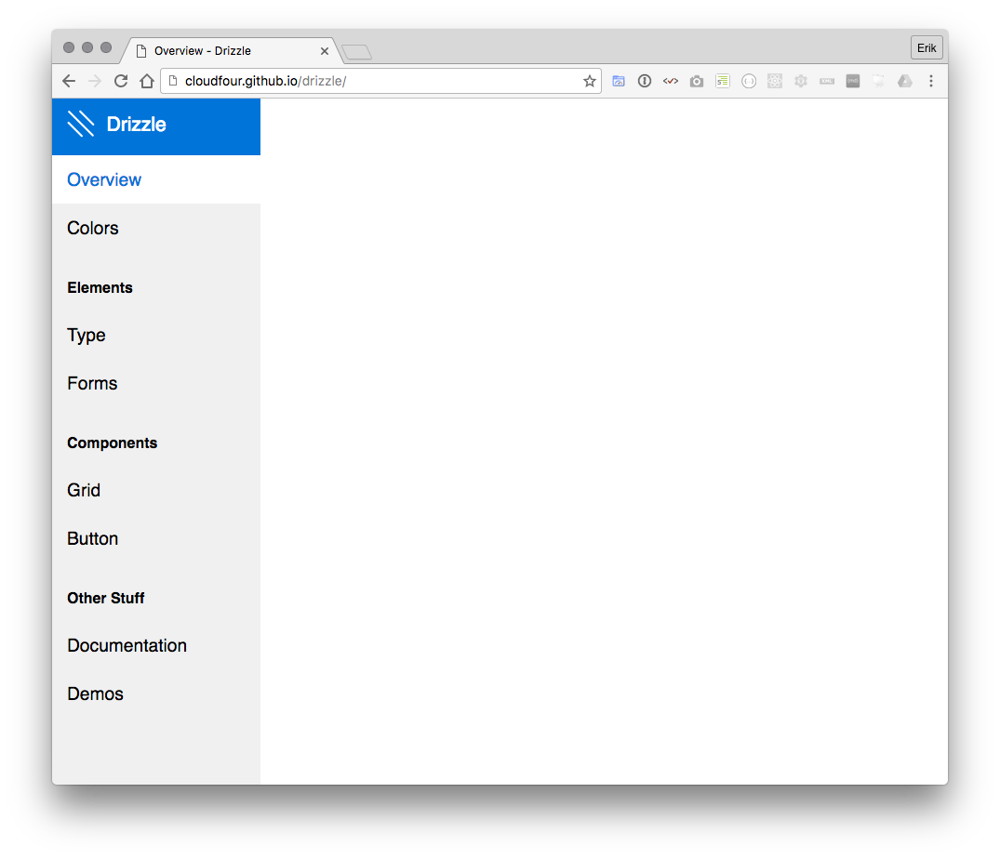

[autoprefixer]: https://github.com/postcss/autoprefixer
[browserslist]: https://github.com/ai/browserslist
[node]: http://nodejs.org
[gulp]: http://gulpjs.com
[handlebars]: http://handlebarsjs.com
[handlebars-layouts]: https://github.com/shannonmoeller/handlebars-layouts
[fabricator]: https://fbrctr.github.io
[solid]: http://solid.buzzfeed.com
[pattern-lab]: http://patternlab.io
[front-matter]: https://github.com/jxson/front-matter
[marked]: https://github.com/chjj/marked
[download]: https://github.com/cloudfour/drizzle/archive/master.zip
[demo-default]: https://cloudfour.github.io/drizzle
[demo-collection]: https://cloudfour.github.io/drizzle/patterns/components/button.html
[demo-blank]: https://cloudfour.github.io/drizzle/demos/demo-example-1.html

<!-- START doctoc generated TOC please keep comment here to allow auto update -->
<!-- DON'T EDIT THIS SECTION, INSTEAD RE-RUN doctoc TO UPDATE -->
### Contents

- [Getting Started](#getting-started)
  - [Installation](#installation)
  - [Tasks](#tasks)
- [Project Structure](#project-structure)
  - [Patterns](#patterns)
  - [Pages](#pages)
  - [Data](#data)
  - [Front-matter](#front-matter)
  - [Templates](#templates)
  - [Helpers](#helpers)
  - [Stylesheets](#stylesheets)
  - [JavaScript](#javascript)
- [Customization](#customization)
  - [Branding](#branding)
  - [Appearance](#appearance)
- [Advanced](#advanced)
- [Browsers](#browsers)
- [Acknowledgements](#acknowledgements)

<!-- END doctoc generated TOC please keep comment here to allow auto update -->

# Getting Started

Drizzle is built on the [Node.js][node] platform, so be sure to have it installed before proceeding.

## Installation

1. [Download][download] and extract a copy of the source.
2. Run `npm start` in the resulting directory.

This will install dependencies, build your toolkit, and start the development server at <http://localhost:3000>.

## Tasks

The build sequence consists of a small set of [Gulp][gulp] tasks. While you'll probably only need `gulp` and `gulp --dev` most of the time, the other tasks can be called independently to process only a subset of your source files:

| Task           | Description
| ---            | ---
| `gulp`         | Build everything and start the development server.
| `gulp --dev`   | Do everything `gulp` does, but with file watching.
| `gulp clean`   | Empty the destination directory.
| `gulp copy`    | Copy static assets into the destination directory.
| `gulp css`     | Process CSS for the toolkit and Drizzle UI.
| `gulp js`      | Process JavaScript for the toolkit and Drizzle UI.
| `gulp drizzle` | Compile all data, pages, and patterns into HTML files.
| `gulp serve`   | Start the development server.
| `gulp watch`   | Run tasks automatically when file changes occur.


# Project Structure

New Drizzle projects contain some boilerplate files to help you get started. The default directory structure looks something like this:

```
my-drizzle-toolkit
├── dist
├── src
│   ├── assets
│   ├── data
│   ├── pages
│   ├── patterns
│   ├── static
│   └── templates
├── browserslist
├── config.js
└── gulpfile.js
```

| File | Description
| ---  | ---
| **dist** | Where toolkit builds are output
| **src/assets/toolkit** | Where toolkit CSS and JavaScript files live
| **src/data** | Where shared [template data](#data) files live
| **src/pages** | Where [Page](#pages) content and templates live
| **src/patterns** | Where [Pattern](#pages) templates live
| **src/static** | Where generic root assets live
| **src/templates** | Where [Page Layout](#layouts) and Drizzle UI templates live
| **browserslist** | The [Browserslist][browserslist] configuration for [Autoprefixer][autoprefixer]
| **config.js** | The [Gulp task](#tasks) configuration module
| **gulpfile.js** | The [Gulp task](#tasks) initialization script

## Patterns

A Pattern is a grouping of markup templates representing a distinct interface element. They are intended to be the most substantial and relevant part of your toolkit content.

The default project structure shows how you might classify patterns as **components** and **elements**:

```
src/patterns
├── components
└── elements
```

But you can use any naming convention that makes sense for your project:

```
src/patterns
├── atoms
├── molecules
└── organisms
```

### Collections

A Pattern _Collection_ is any folder within **src/patterns** that is the parent to one or more template files. The files can be named anything with a **.hbs** or **.html** extension, and will be concatenated into a single file during the build process.

Example input:

```
src/patterns/components
├── button
│   ├── base.hbs
│   └── primary.hbs
└── grid
    ├── default.hbs
    └── responsive.hbs
```

Example output:

```
dist/patterns/components
├── button.html
└── grid.html
```

### Variations

It's common for patterns to consist of multiple variations of the same general piece of markup. For example, the pattern collection for a button component could be structured as:

```
src/patterns/components/button
├── base.hbs
└── primary.hbs
```

These pattern variations are accessible from other templates as partials:

```hbs
{{> patterns.components.button.base}}
```

And for more complex cases, the **{{#extend}}** and **{{#embed}}** helpers can be used:

```hbs
{{#embed "patterns.components.button.base"}}
  ...
{{/embed}}
```

_Refer to the [Recipes](#recipes) section for examples of extending and embedding patterns._


## Pages

Pages can be used to present [Patterns](#patterns), or to supplement them with examples or additional documentation. They can be authored as [Markdown][marked], [Handlebars][handlebars], or standard HTML.

Example input:

```
src/pages
├── demos
│   ├── example.hbs
│   └── index.hbs
├── docs
│   ├── example.md
│   └── index.hbs
├── colors.hbs
└── index.hbs
```

Example output:

```
dist
├── demos
│   ├── example.html
│   └── index.html
├── docs
│   ├── example.html
│   └── index.html
├── colors.html
└── index.html
```

By default, Pages will include the surrounding Drizzle UI elements in their layout:



To use a different [layout template](#layouts), you can assign one in the Page [front-matter](#front-matter):

```yaml
title: Demo Page
layout: blank
```

_Refer to the [Layouts](#layouts) section for more information on the default layout templates._

## Data

To share common data across all [Page](#pages) and [Pattern](#patterns) templates, you can define data files in JSON or YAML format.

Some default files are included:

```
src/data
├── articles.yaml
├── colors.yaml
├── project.yaml
├── radfaces.json
└── specimens.yaml
```

Accessing values from these files can be done with the `{{data}}` template helper. For example:

```yaml
# src/data/team.yaml
- name: Pete
  photo: pete.jpg
- name: Paul
  photo: paul.jpg
- name: Mary
  photo: mary.jpg
```

```hbs
{{! src/pages/team.hbs !}}
{{#each (data "team")}}
  
{{/each}}
```

Results in:

```html
<!-- dist/team.html -->


```

## Front-matter

[Patterns](#patterns) and [Pages](#pages) can leverage [YAML front-matter][front-matter] for local template data:

```
---
name: Basic Button
notes: This is _just_ a **basic** button.
---

<button class="Button">
  {{name}}
</button>
```

These values can be accessed directly within their own template (e.g. `{{name}}`). From outside templates, the values can be accessed via the `data` property:

```hbs
{{#with (page "colors")}}
  {{data.title}}
{{/with}}
```

Front-matter can also be applied to [Pattern Collections](#collections) by using a **collection.yaml** file at the root of the directory:

```
src/patterns/components/button
├── collection.yaml
├── base.hbs
└── primary.hbs
```

### Special Properties

While any arbitrary data can be added and referenced, there are some special property definitions that affect how things are displayed:

| Property       | Type    | Description
| ---            | ---     | ---
| **name**       | string  | Override the default name for Patterns and Collections. Example:&nbsp;`name: My Page`
| **order**      | number |  Override the default sort position for Patterns and Collections. Example:&nbsp;`order: 1`
| **hidden**     | boolean | Hide a Pattern variation from listings.
| **notes**      | string  | Annotate details about a Pattern variation with [Markdown][marked] formatting.
| **links**      | object  | Provide a menu of additional documentation links for a Pattern.
| **sourceless** | boolean | Prevent the HTML source of a Pattern from being displayed.
| **layout**     | string  | Associate a [Layout](#layouts) template to be used for wrapping Page content. Example:&nbsp;`layout: blank`

## Templates

Templates in the **src/templates** directory are intended for the surrounding Drizzle UI.

```
src/templates
├── drizzle
├── blank.hbs
├── collection.hbs
└── default.hbs
```

The templates in this directory differ from [Patterns](#patterns) and [Pages](#pages) in a few ways:

- They are for _presenting_ content (opposed to _being_ content).
- They do not utilize [front-matter][front-matter] data.
- They cannot be iterated over in any way.

### Layouts

Files at the top-level of the templates directory are assumed to be layout templates for [Pages](#pages):

| Layout             | Description
| ---                | ---
| **default.hbs**    | This is for standard pages that do require the presence of the Drizzle UI. [Example][demo-default]
| **blank.hbs**      | This is used for special standalone pages that don't require the presence of the Drizzle UI. [Example][demo-blank]
| **collection.hbs** | This is used for concatenating Pattern collections  into a single page. [Example][demo-collection]

### Partials

Files deeper than the top-level of the templates directory are intended to be used as partials for the Drizzle UI:

```
src/templates/drizzle
├── item.hbs
├── labelheader.hbs
├── logo.hbs
├── nav.hbs
├── page-item.hbs
└── swatch.hbs
```

## Helpers

A handful of helpers are included by default to assist with looking up and listing [Data](#data), [Pages](#pages), and [Patterns](#patterns).

**{{data}}** provides access to [Data](#data):

```hbs
{{#with (data "articles/3")}}
  {{title}} by {{author}}
{{/with}}
```

**{{pages}}** provides access to [Page](#pages) listings:

```hbs
<ul>
  {{#each (pages "portfolio" sortby="date")}}
    <li>
      <a href="{{url}}">{{data.title}}</a>
    </li>
  {{/each}}
</ul>
```

**{{collections}}** provides access to [Pattern collection](#patterncollections) listings:

```hbs
<ul>
  {{#each (collections "components" sortby="order")}}
    <li>
      <a href="{{url}}">{{name}}</a>
    </li>
  {{/each}}
</ul>
```

**{{#extend}}**, **{{#embed}}**, **{{#block}}** and **{{#content}}**:

The [handlebars-layouts][handlebars-layouts] helper suite is included to provide extensible "layout" behavior to all templates:

```hbs
{{! src/templates/foo.hbs }}
<html>
  <body>
    {{#block "main"}}
      Default content
    {{/block}}
  </body>
</html>
```

```hbs
{{#embed "foo"}}
  {{#content "main"}}
    Final content
  {{/content}}
{{/embed}}
```

```html
<html>
  <body>
    Final content
  </body>
</html>
```

Pattern templates can also benefit from these helpers:

```hbs
{{! src/patterns/components/button/base.hbs }}
<button class="Button {{class}}">
  {{#block "content"}}
    Base Button
  {{/block}}
</button>
```

```hbs
{{! src/patterns/components/button/primary.hbs }}
{{#embed "components.button.base" class="Button--primary"}}
  {{#content "content"}}
    Primary Button
  {{/content}}
{{/embed}}
```

```html
<button class="Button Button--primary">
  Primary Button
</button>
```

## Stylesheets

```
assets/toolkit/styles
└── toolkit.css
```

- [ ] **TODO**: Explain place in build process.

## JavaScript

```
src/assets/toolkit/scripts
└── toolkit.js
```

- [ ] **TODO**: Explain place in build process.

# Customization

## Branding

- [ ] **TODO**: Explain logo partial
- [ ] **TODO**: Explain colors page and data

## Appearance

- [ ] **TODO**: Explain class namespaces
- [ ] **TODO**: Changing how the Drizzle UI looks
- [ ] **TODO**: Code highlighting with Prism


# Advanced

- [ ] **TODO**: Overriding CSS and JS for a specific page
- [ ] **TODO**: Extending Patterns using layout helpers
- [ ] **TODO**: Adding PostCSS plugins (`postcss-use`)
- [ ] **TODO**: browserslist/autoprefixer implications


# Browsers

- [ ] **TODO**: Which are supported?

# Acknowledgements

The following projects were inspiration for the design and development of Drizzle:

- [Fabricator][fabricator]
- [Pattern Lab][pattern-lab]
- [Solid][solid]
